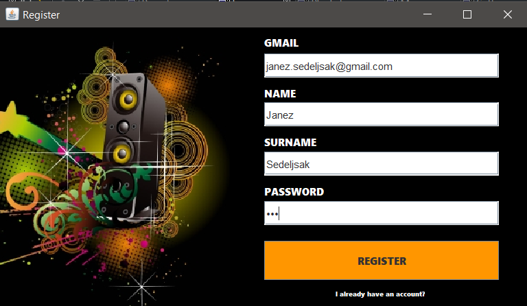
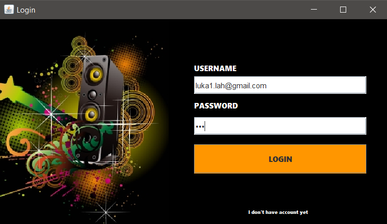
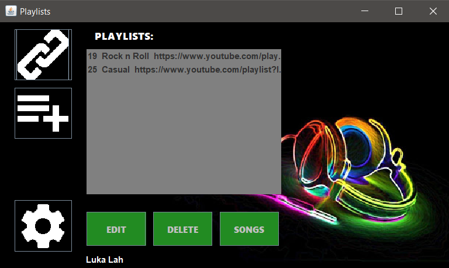
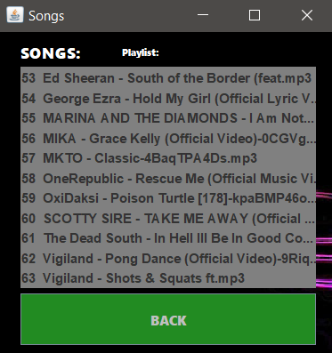
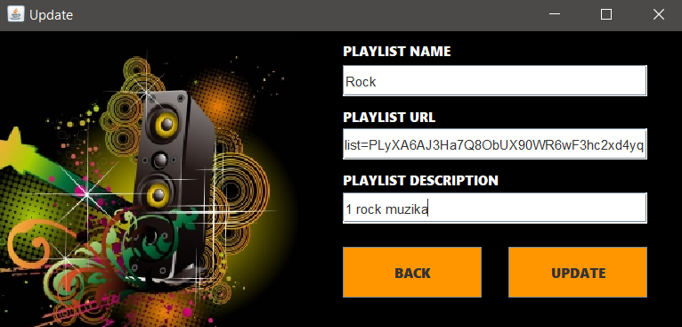
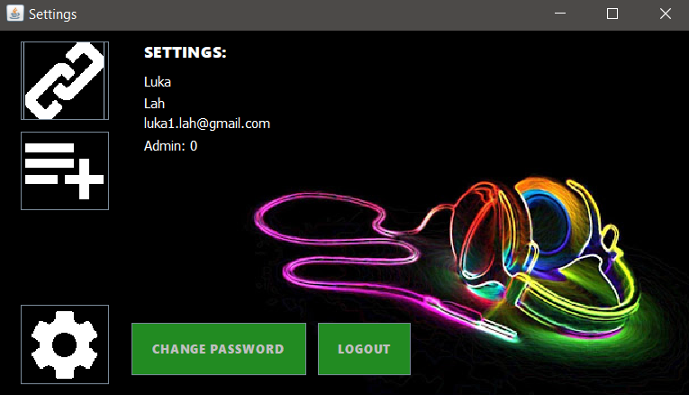
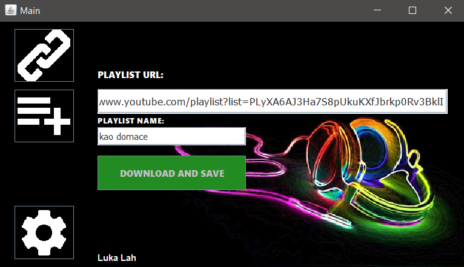
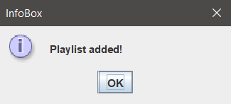
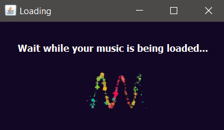

# music2go_java
This is aplication enables you to save playlists from youtube, and see songs for them... and of course download them. So you insert a name for playlist and its url and you get all the songs from playlist downloaded onto your computer. You can of course add, remove, update playlists, create users... This is only the "frontend" of the application (API on https://github.com/Lahlukap669/api_flask).

## !Disclaimer
In some countries act of downloading music from youtube can be illigal or even cause fines. However it is definitely prohibited by youtubes licence and agreements.












## Getting started
1. Download the project
2. Add project to eclipse 
(all needed libraries are already included except java swing which you can download on eclipse marketplace)
3. Run the project

## Prerequisites
* Java

## Built with
* OKHttp
* Simple - Json
* Java swing (swt)

## License


## Authors
```Java
String AUTHOR = "Luka Lah"; //https://github.com/Lahlukap669
```
